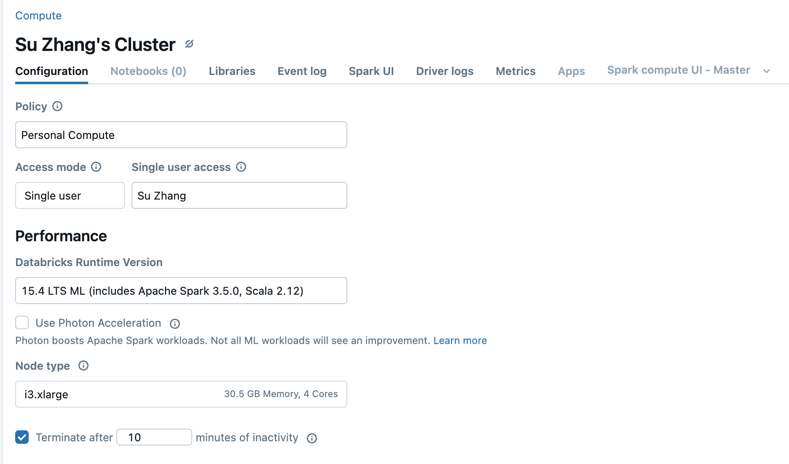
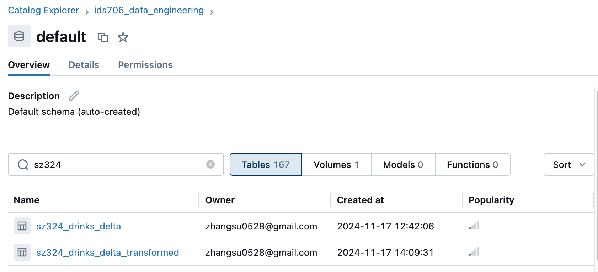
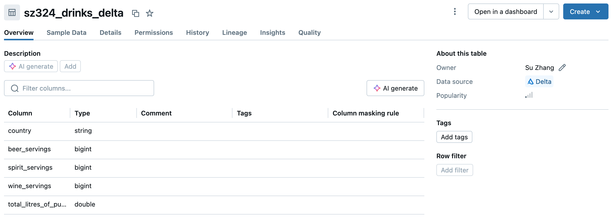
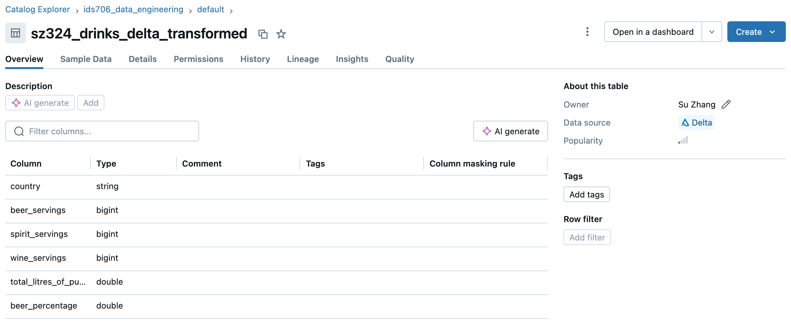
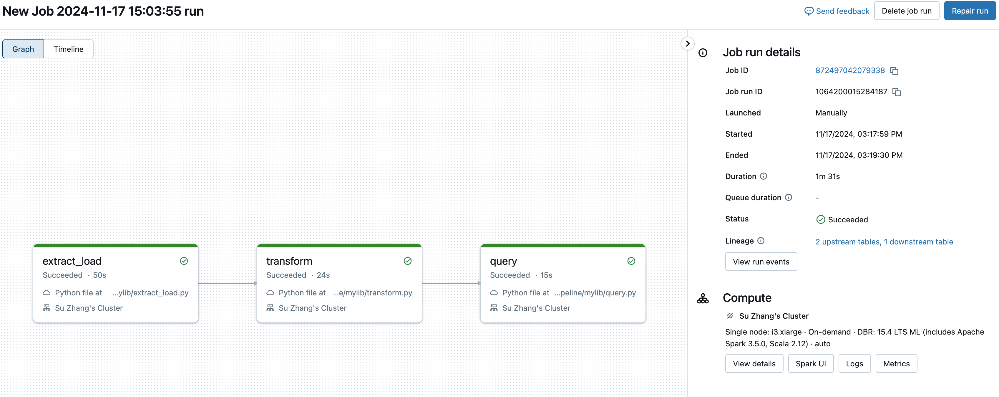

[](https://github.com/nogibjj/Su_Zhang_Databricks_Data_Pipeline/actions/workflows/cicd.yml)

# Su Zhang Data Pipeline Project

This project demonstrates the implementation of an **ETL (Extract, Transform, Load) and Query pipeline within the Databricks environment**. The pipeline is developed using **PySpark**, extracting raw data, applying transformations, and storing the processed data in Delta Tables for efficient querying and analysis.

## Project Overview

The ETL-Query pipeline includes the following steps:
1. **Extract**: Raw data is extracted from online data source and saved in local file path.
2. **Transform**: Data cleaning, formatting, and enrichment processes are applied using **PySpark** to make the data analysis-ready.
3. **Load**: Both the raw data and the transformed data are stored in **Delta Table** within the Databricks environment.
4. **Query**: The Delta Table serves as the foundation for running **SQL** queries and performing analysis efficiently.

## Features

- **PySpark-Based ETL**: Uses PySpark for scalable and efficient data processing.
- **Delta Lake Integration**: Utilizes Delta Tables for versioned, ACID-compliant storage and fast querying.
- **Scalable Processing**: Leverages Databricks' distributed computing capabilities for large datasets.
- **SQL and PySpark Compatibility**: Supports SQL queries and Python-based transformations for flexibility.


## Project Structure

```plaintext
Databricks_Data_Project/
│
├── Databricks_Data_Pipeline   # Exported Databricks notebook (in Python Script format)
│
├── data/                      # Folder containing raw data files (e.g., drinks.csv)
│   └── drinks.csv
│
├── query_log.md               # Exported Databricks query log from running notebook
│
├── README.md                  # Project description
├── requirements.txt           # List of dependencies
└── Makefile                   
```


## Getting Started

### 1. Create a Personal Cluster
   - Navigate to the **Compute** tab in your Databricks workspace.
   - Click **Create Cluster** and provide the necessary configurations:
     - Choose a Spark version compatible with Delta Lake and PySpark.
     - Set the maximum runtime of cluster to managable period.


   
   
---

### 2. Create Databricks Notebook
Create a new notebook in Databricks and implement the ETL pipeline as follows:

### Extract Data

* Load raw data into a Spark DataFrame and saved as delta table in catalog for processing:

```python
from pyspark.sql import SparkSession
import pandas as pd

def extract_load(
    url="https://raw.githubusercontent.com/fivethirtyeight/data/refs/heads/master/alcohol-consumption/drinks.csv",
    filepath="data/sz324_drinks_delta", 
):
    """Extract to file path"""
    spark = SparkSession.builder.appName("Extract Data").getOrCreate()

    df = pd.read_csv(url)
    print(df.head())
    pollingplaces_df = spark.createDataFrame(df)
    
    if spark.catalog.tableExists("sz324_drinks_delta"):
        print("Table 'sz324_drinks_delta' already exists. Skipping append.")
    else:
        # Write to Delta table if it doesn't exist
        pollingplaces_df.write.format("delta").mode("append").saveAsTable("sz324_drinks_delta")
        print("Dataframe saved to table")

    return filepath
```

### Transform Data

* Transform data by adding beer_percentage column and save to a new Delta Table

```python
from pyspark.sql import SparkSession
from pyspark.sql.functions import col, round, when

def transform_data():
    """Transform data by adding beer_percentage column and save to a new Delta table"""
    # Initialize Spark session
    spark = SparkSession.builder.appName("Transform Data").getOrCreate()

    # Define the source Delta table
    source_table_name = "ids706_data_engineering.default.sz324_drinks_delta"

    # Define the target Delta table
    target_table_name = "ids706_data_engineering.default.sz324_drinks_delta_transformed"

    # Read the source Delta table
    df = spark.table(source_table_name)

    # Add the beer_percentage column
    transformed_df = df.withColumn(
    "beer_percentage",
    round(
        when(
            (col("beer_servings") + col("wine_servings") + col("spirit_servings")) > 0,
            col("beer_servings") / (col("beer_servings") + col("wine_servings") + col("spirit_servings"))
        ).otherwise(None),
        3
    )
)

    # Write the transformed data to a new Delta table
    transformed_df.write.format("delta").mode("overwrite").saveAsTable(target_table_name)
    print(f"Transformed data with 'beer_percentage' column saved to table '{target_table_name}'")
```

### Query the Delta Table
Run SQL queries directly on the Delta Table to perform analysis:

```python
def query_data(query):
    delta_table_name = "ids706_data_engineering.default.sz324_drinks_delta_transformed"

    log_query(query, result="Query received, executing query.")
    print(f"Executing SQL query on table {delta_table_name}")
    # Execute the query on the table
    result_df = spark.sql(query)
    pandas_df = result_df.toPandas()
    result_str = pandas_df.to_markdown(index=False)  
    log_query(query, result=result_str)

    return result_df
```

```sql
    SELECT 
        country,
        beer_servings,
        wine_servings,
        spirit_servings,
        beer_percentage,
        CASE 
            WHEN beer_percentage > 0.5 THEN 'High Beer Consumption'
            ELSE 'Moderate/Low Beer Consumption'
        END AS beer_consumption_category
    FROM ids706_data_engineering.default.sz324_drinks_delta_transformed
    WHERE beer_percentage IS NOT NULL
    ORDER BY beer_percentage DESC
    LIMIT 20;
```

### 3. Run the Notebook to Test

* You can see both raw and transformed data are saved as delta table in the catalog

   

* The data source indicated should be `Delta`
   

      

### 4. Create a Databricks Job to Run the Pipeline

* Create three tasks of `extract_load`, `transform` and `query` in one job 
* Add dependicies with requirements.txt that should include all the required dependencies
* Run with your personal compute

   


## Benefits of Using PySpark and Delta Tables

- **PySpark**: Provides scalable data processing capabilities for large datasets.
- **Delta Tables**:
  - **Data Versioning**: Supports time travel to view previous states of data.
  - **Optimized Query Performance**: Indexing and caching enable faster queries.
  - **ACID Transactions**: Ensures consistency and reliability in data operations.

## Logged Output

The logged markdown file could be found [here](https://github.com/nogibjj/Su_Zhang_Databricks_Data_Pipeline/blob/main/query_log.md).

## References and Data Source

* https://github.com/fivethirtyeight/data/tree/master/alcohol-consumption
* https://github.com/nogibjj/python-ruff-template


